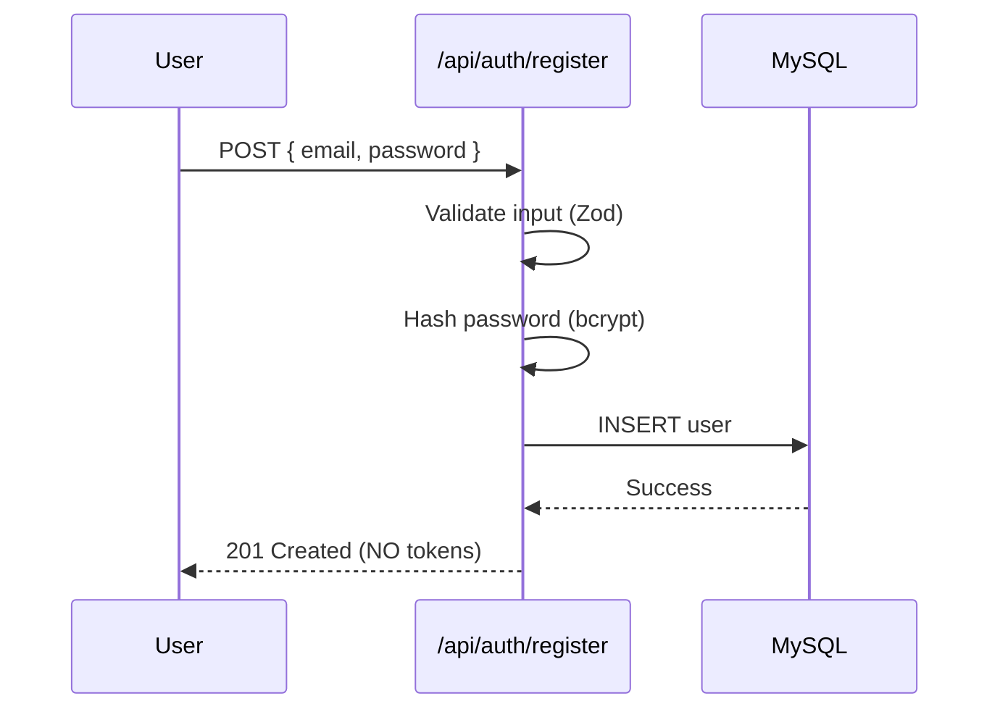
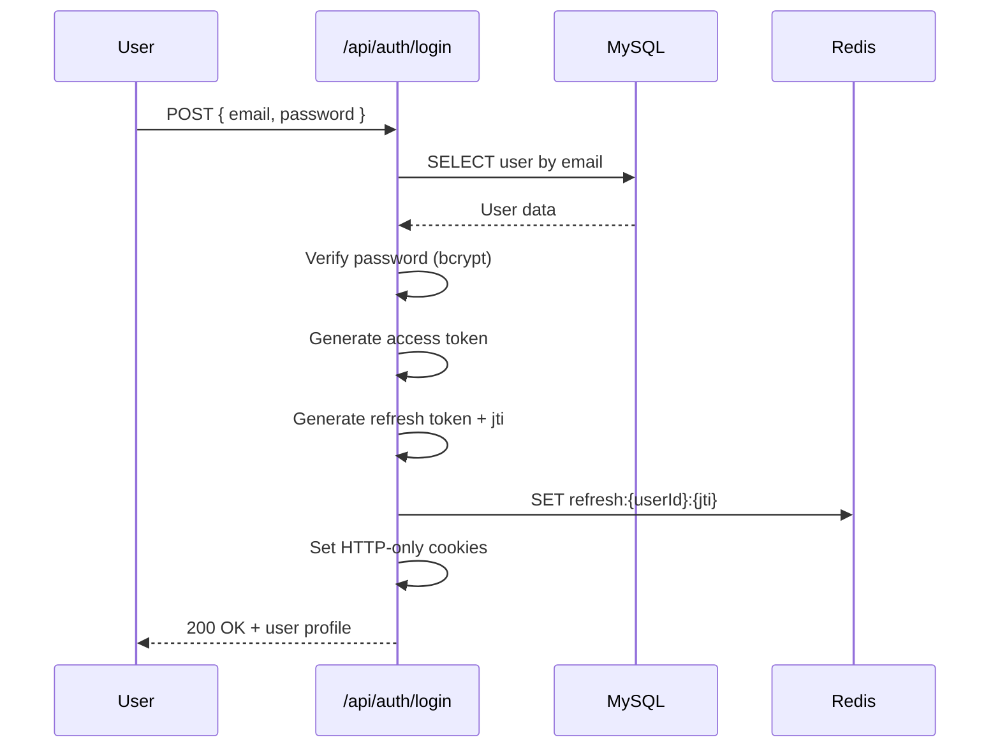
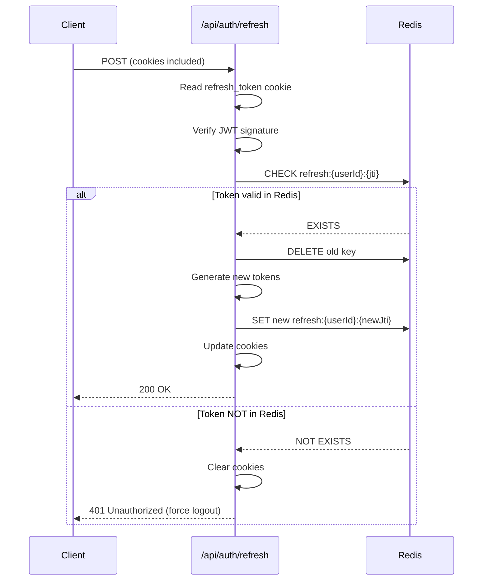
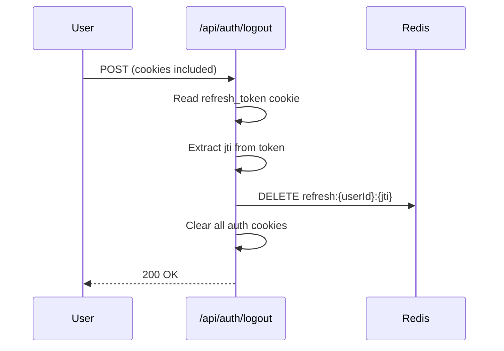
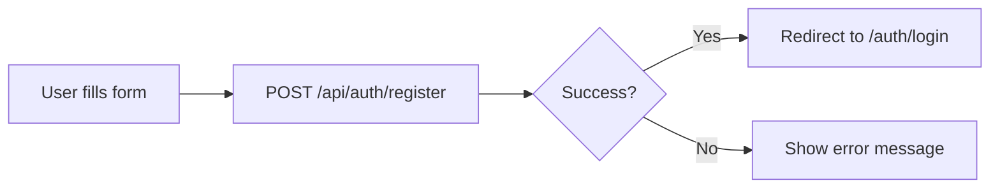
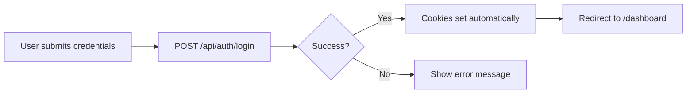
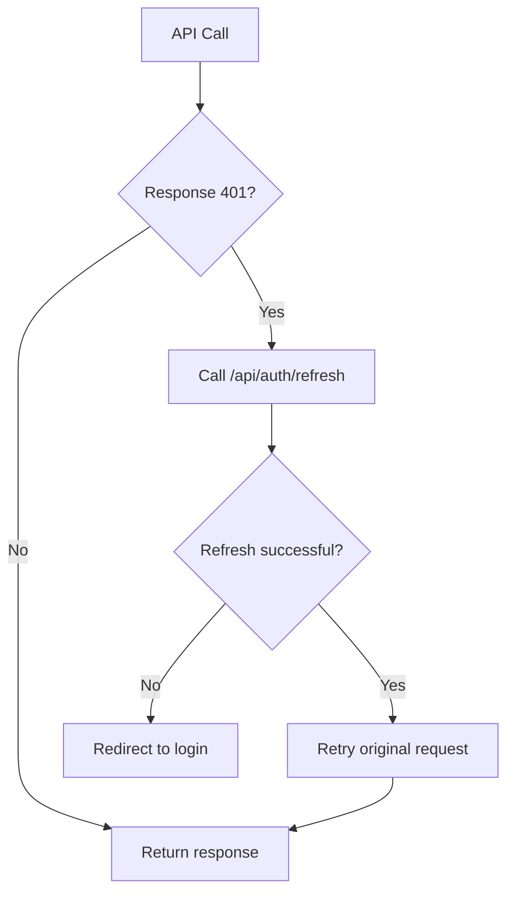

# 🔐 Production-Grade Authentication System

> A comprehensive system design and implementation guide for building a secure authentication system in Next.js.

---

## 📚 Table of Contents

- [Overview](#overview)
- [Tech Stack](#tech-stack)
- [Architecture](#architecture)
  - [Auth Strategy](#1-auth-strategy)
  - [Token Design](#2-token-design)
  - [Redis Usage](#3-redis-usage)
  - [Database Schema](#4-database-schema)
- [Project Structure](#project-structure)
  - [Backend Structure](#5-backend-folder-structure)
  - [Frontend Structure](#6-frontend-folder-structure)
- [Core Utilities](#7-core-utilities)
- [API Flows](#8-api-flows)
- [Frontend Integration](#frontend-integration)
  - [Auth State Strategy](#9-frontend-auth-state-strategy)
  - [Signup Flow](#10-signup-flow)
  - [Sign In Flow](#11-sign-in-flow)
  - [Protected Routes](#12-protected-routes)
  - [Token Expiry Handling](#13-token-expiry-handling)
- [Middleware Protection](#14-middleware-protection)
- [Security Checklist](#15-security-checklist)
- [Flow Diagrams](#16-flow-diagrams)

---

## Overview

This document outlines a **production-grade authentication system** using JWT-based access and refresh tokens, with proper session management, token rotation, and security best practices.

**Key Principles:**
- 🔒 Security-first approach
- 🚀 Scalable architecture
- 🔄 Token rotation for enhanced security
- 📊 Audit trail support

---

## Tech Stack

| Technology | Purpose |
|------------|---------|
| **Next.js** (App Router) | Full-stack React framework |
| **bcryptjs** | Password hashing |
| **MySQL** (mysql2) | Persistent user data storage |
| **Redis** | Session/token control & revocation |
| **JWT** | Access & Refresh tokens |

---

## Architecture

### 1. Auth Strategy

#### Why This Approach?

| Component | Purpose |
|-----------|---------|
| JWT Access Token | Fast, stateless authentication for APIs |
| JWT Refresh Token | Long-lived, securely rotated sessions |
| Redis | Revocation, rotation tracking, session invalidation |
| MySQL | Source of truth (users, roles, audit logs) |
| HTTP-only Cookies | XSS-safe token storage |

> 💡 This is the same pattern used in production SaaS applications.

---

### 2. Token Design

#### Access Token

| Property | Value |
|----------|-------|
| Lifetime | 5–15 minutes (short-lived) |
| Storage | HTTP-only cookie |
| Usage | Every protected request |

**Payload Structure:**

```json
{
  "sub": "user_id",
  "email": "user@email.com",
  "role": "user",
  "iat": 1234567890,
  "exp": 1234568790
}
```

#### Refresh Token

| Property | Value |
|----------|-------|
| Lifetime | 7–30 days (long-lived) |
| Storage | HTTP-only cookie |
| Identifier | `jti` (JWT ID) stored in Redis |
| Security | Rotated on every refresh |

---

### 3. Redis Usage

> ⚠️ **Redis is NOT optional if you want real security.**

#### What Redis Stores

```
Key Pattern: refresh:{userId}:{tokenId}
Value: "valid"
```

#### Why Redis?

| Feature | Benefit |
|---------|---------|
| Instant logout | Immediately invalidate sessions |
| Token rotation | Track current valid tokens |
| Reuse attack detection | Detect stolen/replayed tokens |
| Session management | Kill all sessions if compromised |

---

### 4. Database Schema

#### Users Table

```sql
CREATE TABLE users (
  id BIGINT PRIMARY KEY AUTO_INCREMENT,
  email VARCHAR(255) UNIQUE NOT NULL,
  password_hash VARCHAR(255) NOT NULL,
  role ENUM('user', 'admin') DEFAULT 'user',
  is_active BOOLEAN DEFAULT true,
  created_at TIMESTAMP DEFAULT CURRENT_TIMESTAMP
);
```

#### Login Audit Table (Recommended)

```sql
CREATE TABLE login_audit (
  id BIGINT PRIMARY KEY AUTO_INCREMENT,
  user_id BIGINT,
  ip_address VARCHAR(45),
  user_agent TEXT,
  created_at TIMESTAMP DEFAULT CURRENT_TIMESTAMP,
  FOREIGN KEY (user_id) REFERENCES users(id)
);
```

---

## Project Structure

### 5. Backend Folder Structure

```
src/
├── app/
│   ├── api/
│   │   └── auth/
│   │       ├── login/
│   │       │   └── route.ts       # POST - User login
│   │       ├── register/
│   │       │   └── route.ts       # POST - User registration
│   │       ├── refresh/
│   │       │   └── route.ts       # POST - Token refresh
│   │       ├── logout/
│   │       │   └── route.ts       # POST - User logout
│   │       └── me/
│   │           └── route.ts       # GET - Current user info
│   ├── (protected)/
│   │   └── dashboard/
│   │       └── page.tsx           # Protected dashboard page
│   └── middleware.ts              # Auth middleware
│
├── lib/
│   ├── db/
│   │   ├── mysql.ts               # MySQL connection pool
│   │   └── redis.ts               # Redis client
│   │
│   ├── auth/
│   │   ├── hash.ts                # Password hashing utilities
│   │   ├── jwt.ts                 # JWT sign/verify functions
│   │   ├── cookies.ts             # Cookie management
│   │   ├── token.ts               # Token generation logic
│   │   └── auth-guard.ts          # Route protection helpers
│   │
│   ├── validators/
│   │   └── auth.schema.ts         # Zod validation schemas
│   │
│   └── utils/
│       └── response.ts            # Standardized API responses
│
├── types/
│   └── auth.d.ts                  # TypeScript type definitions
│
└── config/
    └── env.ts                     # Environment configuration
```

### 6. Frontend Folder Structure

```
src/
├── app/
│   ├── auth/
│   │   ├── login/
│   │   │   └── page.tsx           # Login page
│   │   ├── register/
│   │   │   └── page.tsx           # Registration page
│   │   └── layout.tsx             # Auth layout (guest only)
│   │
│   ├── (protected)/
│   │   ├── dashboard/
│   │   │   └── page.tsx           # Dashboard page
│   │   └── layout.tsx             # Protected layout wrapper
│   │
│   └── middleware.ts              # Next.js middleware
│
├── components/
│   ├── auth/
│   │   ├── LoginForm.tsx          # Login form component
│   │   └── RegisterForm.tsx       # Registration form component
│   └── ui/
│       └── Button.tsx             # Reusable UI components
│
├── hooks/
│   └── useAuth.ts                 # Authentication hook
│
├── services/
│   └── auth.service.ts            # Auth API service layer
│
└── types/
    └── user.ts                    # User type definitions
```

---

## 7. Core Utilities

### Password Hashing (bcryptjs)

```typescript
import bcrypt from 'bcryptjs';

const SALT_ROUNDS = 12;

// Hash a password
export async function hashPassword(password: string): Promise<string> {
  return bcrypt.hash(password, SALT_ROUNDS);
}

// Verify a password
export async function verifyPassword(
  password: string, 
  hash: string
): Promise<boolean> {
  return bcrypt.compare(password, hash);
}
```

> ✅ **Security Rules:**
> - Never store plain text passwords
> - Never reuse salts
> - Use salt rounds ≥ 12

### JWT Handling

```typescript
import jwt from 'jsonwebtoken';

// Use SEPARATE secrets for access and refresh tokens
const ACCESS_SECRET = process.env.ACCESS_TOKEN_SECRET!;
const REFRESH_SECRET = process.env.REFRESH_TOKEN_SECRET!;

export function signAccessToken(payload: TokenPayload): string {
  return jwt.sign(payload, ACCESS_SECRET, { expiresIn: '15m' });
}

export function signRefreshToken(payload: TokenPayload, jti: string): string {
  return jwt.sign({ ...payload, jti }, REFRESH_SECRET, { expiresIn: '7d' });
}

export function verifyAccessToken(token: string): TokenPayload {
  return jwt.verify(token, ACCESS_SECRET) as TokenPayload;
}

export function verifyRefreshToken(token: string): RefreshTokenPayload {
  return jwt.verify(token, REFRESH_SECRET) as RefreshTokenPayload;
}
```

> ⚠️ **IMPORTANT:** Always use separate secrets for access and refresh tokens!

### Cookie Strategy

```typescript
import { cookies } from 'next/headers';

const COOKIE_OPTIONS = {
  httpOnly: true,
  secure: process.env.NODE_ENV === 'production',
  sameSite: 'strict' as const,
  path: '/',
};

export function setAuthCookies(accessToken: string, refreshToken: string) {
  cookies().set('access_token', accessToken, {
    ...COOKIE_OPTIONS,
    maxAge: 15 * 60, // 15 minutes
  });
  
  cookies().set('refresh_token', refreshToken, {
    ...COOKIE_OPTIONS,
    maxAge: 7 * 24 * 60 * 60, // 7 days
  });
}

export function clearAuthCookies() {
  cookies().delete('access_token');
  cookies().delete('refresh_token');
}
```

> 🚫 **Never use localStorage for tokens. Ever.**

---

## 8. API Flows

### 🔐 Register Flow



**Steps:**
1. Validate input using Zod schema
2. Hash password with bcrypt (12 rounds)
3. Insert user into MySQL
4. Return success response (**no tokens issued**)

### 🔐 Login Flow



**Steps:**
1. Verify email exists in MySQL
2. Compare password with bcrypt
3. Create access token (15 min)
4. Create refresh token + unique `jti`
5. Store `jti` in Redis
6. Set HTTP-only cookies
7. Return user profile

### 🔄 Refresh Token Rotation



> 🚨 **If Redis key is missing → Force logout** (possible token theft!)

### 🚪 Logout Flow



---

## Frontend Integration

### 9. Frontend Auth State Strategy

> ❌ **Do NOT store tokens in React state**  
> ✅ **Rely on HTTP-only cookies**

The frontend only manages:

```typescript
interface AuthState {
  isAuthenticated: boolean;
  user: {
    id: string;
    email: string;
    role: 'user' | 'admin';
  } | null;
}
```

### 10. Signup Flow



**Register Form Component:**

```typescript
// components/auth/RegisterForm.tsx
'use client';

import { useState } from 'react';
import { useRouter } from 'next/navigation';

export function RegisterForm() {
  const router = useRouter();
  const [loading, setLoading] = useState(false);
  const [error, setError] = useState<string | null>(null);

  const onSubmit = async (data: { email: string; password: string }) => {
    setLoading(true);
    setError(null);

    try {
      const res = await fetch('/api/auth/register', {
        method: 'POST',
        headers: { 'Content-Type': 'application/json' },
        body: JSON.stringify(data),
      });

      if (res.ok) {
        router.push('/auth/login');
      } else {
        const errorData = await res.json();
        setError(errorData.message || 'Registration failed');
      }
    } catch (err) {
      setError('An unexpected error occurred');
    } finally {
      setLoading(false);
    }
  };

  // ... form JSX
}
```

> ⚠️ **Best Practice:** No auto-login after signup. Users should explicitly log in.

### 11. Sign In Flow



**Login Form Component:**

```typescript
// components/auth/LoginForm.tsx
'use client';

import { useState } from 'react';
import { useRouter } from 'next/navigation';

export function LoginForm() {
  const router = useRouter();
  const [error, setError] = useState<string | null>(null);

  const onSubmit = async (data: { email: string; password: string }) => {
    setError(null);

    const res = await fetch('/api/auth/login', {
      method: 'POST',
      credentials: 'include', // Important for cookies!
      headers: { 'Content-Type': 'application/json' },
      body: JSON.stringify(data),
    });

    if (res.ok) {
      router.push('/dashboard');
    } else {
      setError('Invalid email or password');
    }
  };

  // ... form JSX
}
```

### 12. Protected Routes

**useAuth Hook:**

```typescript
// hooks/useAuth.ts
'use client';

import { useState, useEffect } from 'react';

interface User {
  id: string;
  email: string;
  role: 'user' | 'admin';
}

export function useAuth() {
  const [user, setUser] = useState<User | null>(null);
  const [loading, setLoading] = useState(true);

  useEffect(() => {
    fetch('/api/auth/me', { credentials: 'include' })
      .then((res) => (res.ok ? res.json() : null))
      .then((data) => setUser(data?.user ?? null))
      .catch(() => setUser(null))
      .finally(() => setLoading(false));
  }, []);

  return {
    user,
    loading,
    isAuthenticated: !!user,
  };
}
```

**Protected Layout:**

```typescript
// app/(protected)/layout.tsx
'use client';

import { redirect } from 'next/navigation';
import { useAuth } from '@/hooks/useAuth';
import { Spinner } from '@/components/ui/Spinner';

export default function ProtectedLayout({
  children,
}: {
  children: React.ReactNode;
}) {
  const { isAuthenticated, loading } = useAuth();

  if (loading) {
    return <Spinner />;
  }

  if (!isAuthenticated) {
    redirect('/auth/login');
  }

  return <>{children}</>;
}
```

### 13. Token Expiry Handling



**Centralized Fetch Wrapper:**

```typescript
// services/auth.service.ts
export async function authFetch(
  url: string,
  options: RequestInit = {}
): Promise<Response> {
  // First attempt
  let res = await fetch(url, {
    ...options,
    credentials: 'include',
  });

  // If unauthorized, try refreshing token
  if (res.status === 401) {
    const refreshRes = await fetch('/api/auth/refresh', {
      method: 'POST',
      credentials: 'include',
    });

    if (refreshRes.ok) {
      // Retry original request with new token
      res = await fetch(url, {
        ...options,
        credentials: 'include',
      });
    }
  }

  return res;
}
```

---

## 14. Middleware Protection

```typescript
// middleware.ts
import { NextResponse } from 'next/server';
import type { NextRequest } from 'next/server';

export function middleware(request: NextRequest) {
  const token = request.cookies.get('access_token');
  const isAuthPage = request.nextUrl.pathname.startsWith('/auth');
  const isProtectedPage = request.nextUrl.pathname.startsWith('/dashboard');

  // Redirect to login if accessing protected route without token
  if (isProtectedPage && !token) {
    return NextResponse.redirect(new URL('/auth/login', request.url));
  }

  // Redirect to dashboard if accessing auth pages while logged in
  if (isAuthPage && token) {
    return NextResponse.redirect(new URL('/dashboard', request.url));
  }

  return NextResponse.next();
}

export const config = {
  matcher: ['/dashboard/:path*', '/auth/:path*'],
};
```

> ⚠️ **Middleware Rules:**
> - ✅ Fast execution
> - ✅ No database calls
> - ✅ Runs at the edge
> - ✅ Only JWT verification

---

## 15. Security Checklist

### Non-Negotiable Requirements

| Requirement | Status | Description |
|-------------|--------|-------------|
| bcrypt salt ≥ 12 | ✅ | Adequate hashing rounds |
| Rotate refresh tokens | ✅ | New token on each refresh |
| Redis-backed sessions | ✅ | Server-side session control |
| HTTP-only cookies | ✅ | Prevent XSS token theft |
| Separate JWT secrets | ✅ | Different keys for access/refresh |
| Rate-limit auth routes | ✅ | Prevent brute force attacks |
| CSRF protection | ✅ | `sameSite=strict` cookies |

### Feature Comparison

| Feature | This Setup |
|---------|------------|
| Stateless auth | ✅ |
| Session revocation | ✅ |
| Horizontal scaling | ✅ |
| XSS protection | ✅ |
| Token replay protection | ✅ |
| Production-ready | ✅ |

---

## 16. Flow Diagrams

### Complete Authentication System Flow

```mermaid
flowchart TB
    subgraph Frontend
        A[Login Form] --> B[Submit Credentials]
        C[Register Form] --> D[Create Account]
        E[Protected Page] --> F[useAuth Hook]
    end

    subgraph Backend API
        G[/api/auth/login]
        H[/api/auth/register]
        I[/api/auth/refresh]
        J[/api/auth/logout]
        K[/api/auth/me]
    end

    subgraph Storage
        L[(MySQL)]
        M[(Redis)]
    end

    B --> G
    D --> H
    F --> K

    G --> L
    G --> M
    H --> L
    I --> M
    J --> M
    K --> L

    style Frontend fill:#e1f5fe
    style Backend API fill:#fff3e0
    style Storage fill:#f3e5f5
```

### Mental Model

```
┌─────────────────────────────────────────────────────────┐
│                    🔐 AUTH SYSTEM                        │
├─────────────────────────────────────────────────────────┤
│                                                         │
│   Frontend NEVER sees tokens                            │
│        ↓                                                │
│   Cookies handle auth automatically                     │
│        ↓                                                │
│   Redis controls session validity                       │
│        ↓                                                │
│   JWT handles identity claims                           │
│        ↓                                                │
│   MySQL stores the source of truth                      │
│                                                         │
└─────────────────────────────────────────────────────────┘
```

---

## 🚀 Next Steps

Choose what to implement next:

- [ ] Write actual code for each API route
- [ ] Implement complete JWT + Redis logic
- [ ] Add Role-Based Access Control (RBAC)
- [ ] Add OAuth providers (Google/GitHub)
- [ ] Add "Remember Me" functionality
- [ ] Create a complete project boilerplate

---

## 📄 License

This documentation is part of the `auth_app` project.
